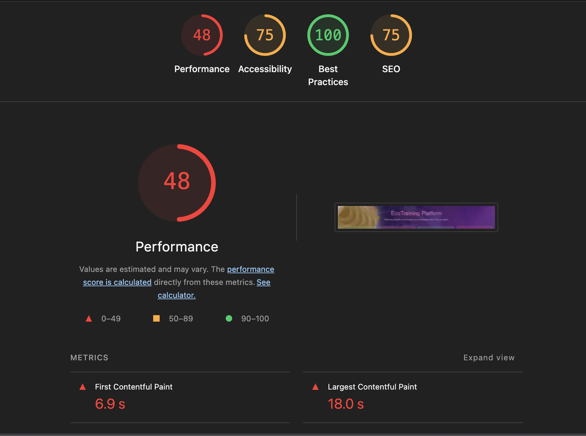
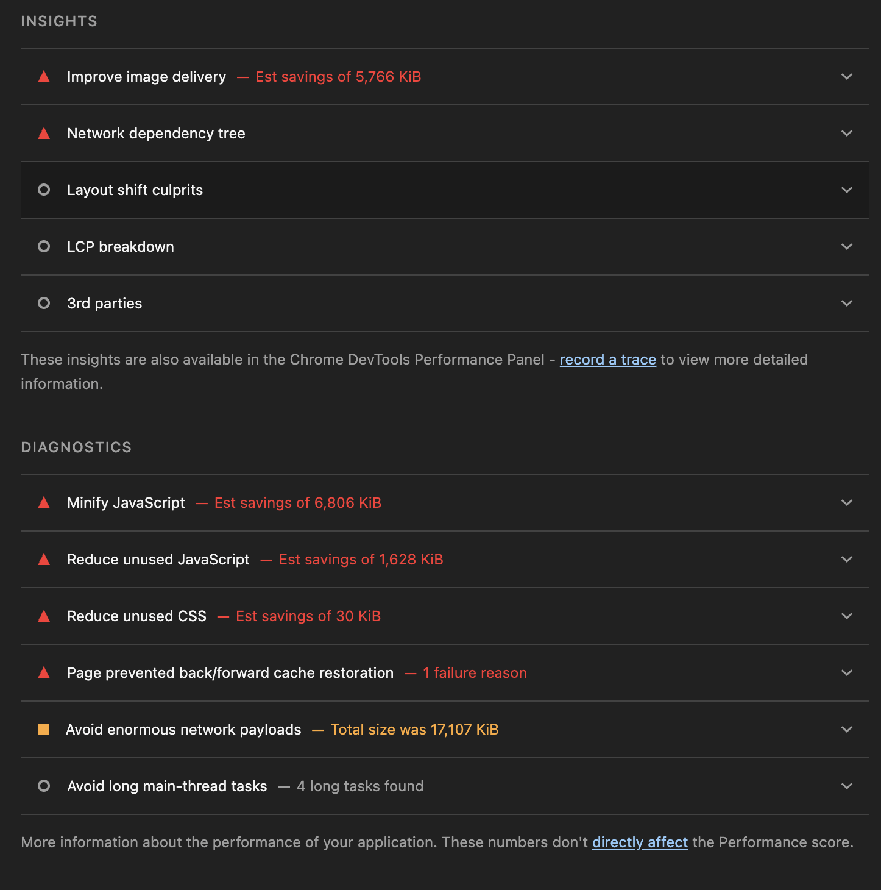
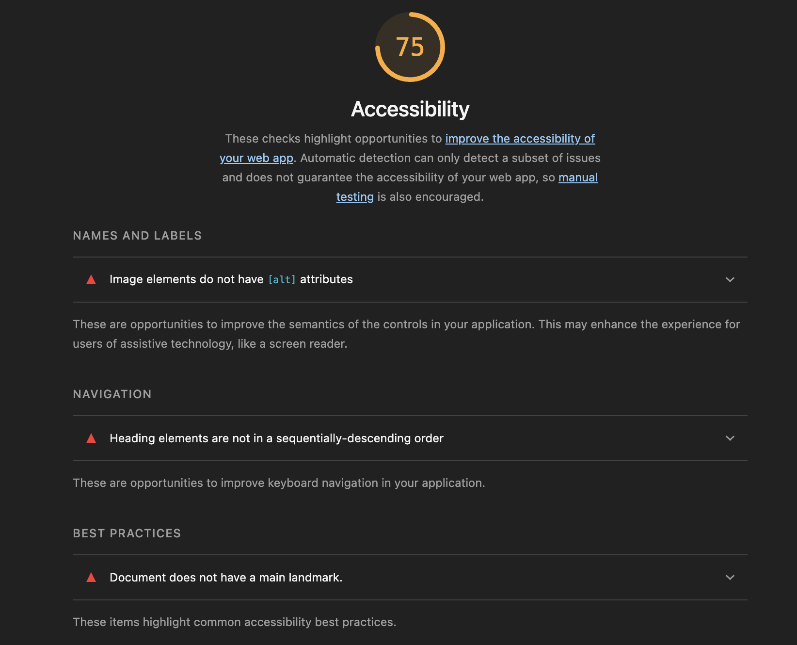
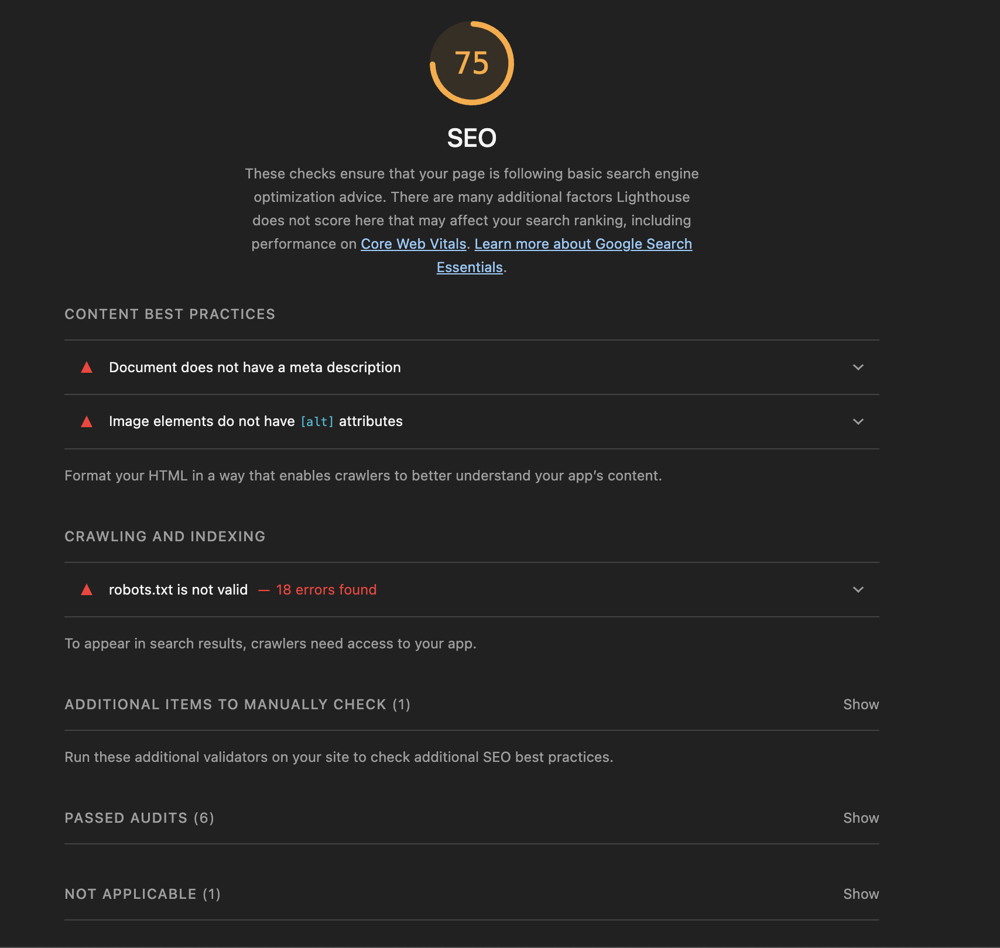

## Phase 1 : Mesure

#### On remarque plusieurs points d'attention sur la capture de bas des métriques:

- le poids html n'est que d'1KB
- le js fait : 3251KB
- le DOM a 187 noeuds
- les ressources chargés sont au nombre de 250
- le poid CSS est très important 7093,7KB
- le poids des images est aussi élevé 7094KB
- le cache du navigateur n'est pas utilisé -2%
- le serveur n'a pas de ram et de cpu alloué
- la fréquence des requêtes est nulle
- le temps de chargement est beaucoup trop important 194s soit 3minutes et 23s.

#### Les résultats du test lightouse en globalité:

#### Les résultats du test lightouse pour les performances:

**Score: 48/100 - Critique**

##### Origine des problèmes de performance:
- **First Contentful Paint (FCP): 6.9s** - Le contenu principal met trop de temps à s'afficher en raison du téléchargement et du parsing du JavaScript et CSS volumineux
- **Largest Contentful Paint (LCP): 18.0s** - Les images non optimisées (7094KB) et les ressources critiques bloquantes retardent le rendu du plus grand élément visible
- **JavaScript non minifié**: Économies potentielles de 6,806 KiB en minification
- **JavaScript inutilisé**: 1,628 KiB de code non utilisé doit être supprimé
- **CSS inutilisé**: 30 KiB de styles non utilisés
- **Images non optimisées**: 7094KB total, opportunité d'économiser 5,766 KiB avec optimisation d'image
- **Ressources bloquantes**: 250 ressources chargées dont plusieurs bloquent le rendu

##### Plan de résolution (User Stories):

**US-PERF-001**: Optimiser les images (webp, compression, lazy loading)
- Conversion des images en format webp
- Mise en place du lazy loading pour les images hors viewport
- Objectif: économiser 5,766 KiB

**US-PERF-002**: Minifier et bundler le JavaScript
- Mise en place de minification JS
- Tree-shaking des dépendances inutilisées
- Code splitting par route
- Objectif: économiser 6,806 KiB

**US-PERF-003**: Optimiser et nettoyer le CSS
- Suppression des styles inutilisés
- Utilisation de CSS-in-JS ou utility-first CSS
- Objectif: économiser 30 KiB et réduire 7093.7KB

**US-PERF-004**: Implémenter une stratégie de cache HTTP
- Configuration des headers Cache-Control
- Service worker pour le caching client
- Objectif: utiliser le cache navigateur (actuellement à -2%)

**US-PERF-005**: Mettre en place le server-side rendering (SSR) ou static generation
- Réduire le travail JavaScript côté client
- Améliorer FCP et LCP
- Objectif: réduire FCP < 2.5s et LCP < 2.5s

---

#### Les résultats du test lightouse pour l'accessibilité:

**Score: 75/100 - À améliorer**

##### Origine des problèmes d'accessibilité:
- **Contraste insuffisant** sur certains éléments texte/fond
- **Navigation au clavier** non optimale sur les composants interactifs
- **Structure heading** non logique (h1/h2/h3 mal organisés)
- **Labels formulaires** manquants ou mal associés
- **Attributs ARIA** manquants sur les widgets personnalisés

##### Plan de résolution (User Stories):

**US-A11Y-001**: Corriger les contrastes de couleur
- Audit des ratios de contraste (WCAG 2.1 AA minimum)
- Ajustement des couleurs du thème purple/orange
- Objectif: Score 90+

**US-A11Y-002**: Implémenter la navigation au clavier complète
- Focus visible sur tous les éléments interactifs
- Navigation logique à la tabulation
- Touches Échap et Entrée fonctionnelles
- Objectif: Navigation clavier fluide

**US-A11Y-003**: Structurer correctement les headings
- Un seul h1 par page
- Hiérarchie h1 → h2 → h3 cohérente
- Objectif: Structure sémantique validée

**US-A11Y-004**: Ajouter les attributs ARIA manquants
- Attributs aria-label/aria-labelledby
- Rôles ARIA pour composants personnalisés
- Attributs aria-live pour contenu dynamique
- Objectif: Score 95+

---

#### Les résultats du test lightouse pour le SEO:

**Score: 75/100 - À améliorer**

##### Origine des problèmes SEO:
- **Meta description manquante** sur la page - nécessaire pour l'affichage en résultats de recherche
- **Attributs alt manquants** sur les images - les moteurs de recherche ne comprennent pas le contenu des images
- **robots.txt invalide** (18 erreurs trouvées) - les crawlers ne savent pas quelles pages indexer
- **Pas de structured data** (JSON-LD) pour le contexte sémantique
- **HTML non bien formé** pour les crawlers

##### Plan de résolution (User Stories):

**US-SEO-001**: Ajouter meta descriptions et open graph
- Meta description unique pour chaque page (155-160 caractères)
- Open Graph tags (og:title, og:description, og:image)
- Twitter Card tags
- Objectif: Affichage optimisé en résultats de recherche

**US-SEO-002**: Ajouter les attributs alt sur toutes les images
- Attributs alt descriptifs et pertinents
- Éviter alt vide sur images décoratives
- Objectif: Toutes les images avec alt valide

**US-SEO-003**: Corriger et valider robots.txt
- Fixer les 18 erreurs du robots.txt
- Définir les règles allow/disallow
- Soumettre à Google Search Console
- Objectif: robots.txt valide

**US-SEO-004**: Implémenter structured data (Schema.org)
- Schema.org pour Product/Organization/Article
- Balisage JSON-LD pour riche snippets
- Test avec Google Rich Results Test
- Objectif: Affichage enrichi en résultats de recherche

**US-SEO-005**: Optimiser la structure HTML et sémantique
- Utiliser tags sémantiques (main, article, section, nav)
- URL structure claire et descriptive
- Breadcrumbs pour navigation
- Objectif: Score SEO 90+

